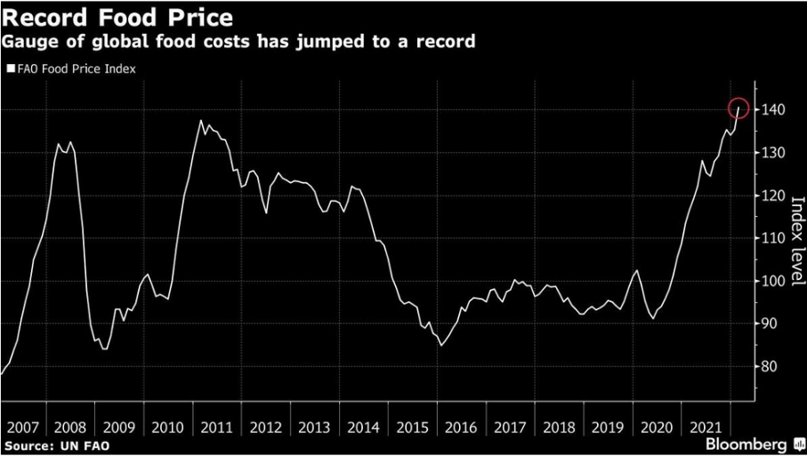
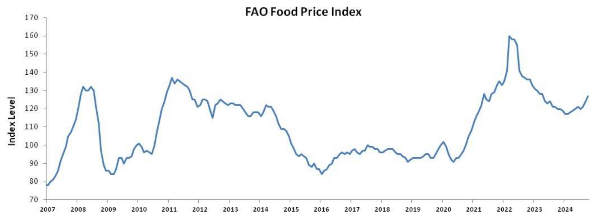

# README — Dato público para la alfabetización matemática crítica

Repositorio inspirado y conectado con el TFM **XXXXX** (UDIMA, 2026): scripts y materiales para facilitar al profesorado la descarga, limpieza y preparación de **dato público** para el aula.

## Índice
1. [Introducción](#1-introducción)
2. [Dato para el sentido estocástico](#2-dato-para-el-sentido-estocástico)
3. [Data para los sentidos numérico, algebraico, de la medida y socioafectivo](#3-data-para-los-sentidos-numérico-algebraico-de-la-medida-y-socioafectivo)
4. [MCP+Blender para el sentido espacial](#4-mcpblender-para-el-sentido-espacial)
5. [Datos descargables directamente desde la web (tipo Google Trends)](#5-datos-descargables-directamente-desde-la-web-tipo-google-trends)

---

## 1) Introducción

El aprendizaje no es exclusivo del alumnado; en un sistema constructivista el profesorado también evoluciona continuamente en su práctica, adaptándose a un contexto educativo en constante cambio. Este desafío puede transformarse en una oportunidad para experimentar e innovar, organizando talleres o actividades que involucren no solo a estudiantes, sino también a otros docentes y familias.

En este marco, el concepto de **alfabetización matemática** emerge como un eje fundamental, vinculado tanto a la educación matemática como a la dimensión emocional de las matemáticas. Su relevancia se amplifica hoy en día gracias al acceso creciente a datos y herramientas tecnológicas.

Este repositorio propone una visión de la educación matemática centrada en un **tratamiento sencillo de datos** como instrumentos para una **alfabetización matemática crítica** del alumnado y un mayor control por parte del profesorado, mediante iniciativas de modelización de datos, exploración de sesgos, etc. (En esta línea, se integran ejemplos de regresión lineal, series temporales y aproximaciones a modelos simples de IA cuando tenga sentido didáctico).

Los datos se han convertido en un eje central de la sociedad actual (economía, tecnología, política). Por lo tanto, es importante introducir una alfabetización matemática crítica para comprender y cuestionar cómo los datos son recolectados, procesados y utilizados.

**¿Cómo se puede construir una educación matemática que fomente un pensamiento crítico sobre los datos y su procesamiento?** Dotar al alumnado de herramientas para analizar de manera crítica los modelos que se presentan a diario (por ejemplo, en las noticias) es fundamental para lograrlo. En este sentido, resulta imprescindible que los estudiantes adquieran habilidades para manejar datos y aprender técnicas de modelado sencillo, desarrollando así un espíritu crítico.

El modelado matemático debe enseñarse con un enfoque crítico, animando a los estudiantes a cuestionar el uso de estos modelos en la sociedad y a reflexionar sobre su impacto en las decisiones tecnológicas y sociales.

### Ejemplo motivador con series temporales (lectura crítica y visual)
Un ejemplo efectivo es trabajar con **series temporales**, ya que su orden cronológico natural las hace especialmente intuitivas para la visualización y el análisis inicial. Por inspección visual (y con tareas bien guiadas), el alumnado puede reconocer **tendencias, estacionalidades, ciclos, ruido, anomalías, estabilidad/volatilidad, cambios de nivel y periodicidades**, entre otros elementos.

  

**Figura F1.** Captura de una noticia en la que aparece una serie temporal (Índice de Precios de los Alimentos de la FAO) utilizada como disparador didáctico. A partir del gráfico periodístico se plantea una primera lectura e hipótesis interpretativa —por ejemplo, que el último pico pueda estar relacionado con el impacto de la guerra de Ucrania en los mercados—, subrayando que se trata de una conjetura inicial que debe verificarse con datos y contexto antes de convertirla en conclusión.

  

**Figura F2.** Serie temporal del Índice de Precios de los Alimentos de la FAO reconstruida y actualizada mediante scripts a partir de la fuente oficial, como continuación del trabajo iniciado con la noticia. Al disponer del dato en formato tratable (CSV), el profesorado y el alumnado ganan control sobre las actualizaciones y pueden operar con la serie (limpieza, recortes temporales, comparaciones, etc.), contrastando de forma fundamentada las hipótesis formuladas en la Figura F1 y revisando la interpretación a la luz del dato completo.

Las anteriores figuras presenta una interacción con un indicador de precio de alimentos de la FAO. El código de descarga se encuentra en /scripts/

Estos trabajos son especialmente adecuados para crear grupos de investigación (favoreciendo el aprendizaje) y pueden involucrar, con tareas apropiadas, a la familia del alumnado de una manera emocional y positiva. Además, la dimensión visual de estos datos suele ser relativamente asequible de explicar verbalmente, aumentando canales de transmisión (visual + verbal).

### Cierre de enfoque
La educación matemática que se persigue aquí está fundamentada en el desarrollo de un pensamiento crítico sobre los datos y su impacto en la sociedad: no solo manejar técnicas básicas (regresiones, series temporales), sino comprender y cuestionar cómo los datos son recolectados, procesados y utilizados; incluyendo, cuando proceda, ejemplos con sesgos en modelos y decisiones metodológicas.

---

## 2) Dato para el sentido estocástico

Este apartado operacionaliza la conexión central con el TFM: **la alfabetización matemática crítica** se implementa de forma prioritaria en el **sentido estocástico**, porque es el vehículo más directo para trabajar lectura crítica de cuantificación pública: indicadores, titulares, gráficos, comparativas, rankings, “evidencias” y afirmaciones sostenidas (o no) por datos.

La lógica es clara:

- **Dato público actualizado** como “ariete” de motivación (horizontalidad): el alumnado entra por un contexto significativo (actualidad, entorno, debate social).
- **Formalización progresiva** (verticalidad): a partir del contexto, se consolidan herramientas estadísticas formales (tablas, gráficos bien construidos, medidas descriptivas, correlación cuando proceda, y comunicación responsable).

### Fuentes y automatización (la razón de ser del repo)
Acceder a datos públicos puede ser difícil para el profesorado por fricción técnica (formatos, portales, APIs, cambios de URL, limpieza). Este repositorio busca “enchufar un cable” al docente:

- **Scripts en R y Python** para:
  - descargar datos públicos (INE, Eurostat, Our World in Data, portales abiertos, etc.),
  - realizar limpieza mínima reproducible,
  - exportar a **CSV** (y, si aplica, a formatos auxiliares listos para hoja de cálculo).

**Salida estándar:** `*.csv` listos para aula (Calc/Excel/Sheets), con convenciones de nombres y metadatos mínimos.

> Sugerencia de estructura (orientativa):
> - `scripts_python/`  
> - `scripts_R/`  
> - `data_raw/` (descarga)  
> - `data_processed/` (CSV final)  
> - `docs/` (fichas didácticas, figuras, ejemplos)

### Qué se pretende trabajar (núcleo de aula)
- Lectura crítica de gráficos (detección de manipulación visual, ejes truncados, cherry-picking temporal).
- Validación básica de fuentes (incluso “lo oficial” puede tener errores técnicos temporales).
- Estadística descriptiva contextual (no “calcular por calcular”).
- Comunicación matemática: transparencia metodológica (fuente, periodo, variable, limitaciones).
- Correlación vs causalidad (cuando proceda, sin sobreactuar formalismo).

---

## 3) Data para los sentidos numérico, algebraico, de la medida y socioafectivo

Este repositorio no se limita al sentido estocástico. La idea (coherente con el TFM) es que el **dato público** funcione como **contexto transversal**: al menos una sesión por sentido (según programación), sin “secuestrar” el curso.

### Sentido numérico
- Porcentajes, tasas, variaciones interanuales, índices.
- Ejemplos típicos: inflación, paro, presupuestos, distribución de gasto, evolución salarial.
- Enfoque crítico: qué mide el índice, bajo qué supuestos, qué queda fuera.

### Sentido de la medida
- Magnitudes, escalas, unidades, conversión, comparabilidad.
- Ejemplos: climatología, energía, consumo, densidades, ratios por habitante.
- Enfoque crítico: comparaciones válidas vs inválidas, normalizaciones, escalas engañosas.

### Sentido algebraico/funcional (ejemplo mínimo solicitado)
En funciones, se puede modelizar datos con **decaimientos** mediante **funciones exponenciales de argumento negativo**, por ejemplo:

- fenómenos de “bajada rápida y estabilización”,
- evolución de ciertas magnitudes tras un pico (con cuidado metodológico),
- procesos donde el decrecimiento es proporcional al valor actual.

(El repositorio aspira a aportar datasets y CSV que permitan *al menos* construir, ajustar y discutir este tipo de modelos de forma guiada.)

### Sentido socioafectivo (transversal)
- Trabajo cooperativo con roles (analista, verificador de fuente, redactor, diseñador de gráfico, portavoz).
- Discusión ética y prudencia interpretativa: “qué puedo afirmar” vs “qué no puedo afirmar”.
- Empoderamiento: publicar productos (infografías/noticiario escolar) con responsabilidad.

---

## 4) MCP+Blender para el sentido espacial

Este apartado añade “artillería” que no necesariamente se despliega en el TFM centrado en dato público: **verbalización matemática + visualización 3D profesional** como palanca para el **sentido espacial** (y conexiones álgebra-geometría).

La propuesta se apoya en una idea fuerte:

- **Describir matemáticamente (verbalizar) como entrada primaria**:  
  “Crea un cubo de lado 2”, “Corta el cubo con el plano x + y + z = 1”, “Intersecciona y muestra solo la sección”.
- La tecnología actúa como **intérprete y ejecutor** de la intención matemática, permitiendo:
  - modelado 3D nativo,
  - operaciones booleanas (intersección, unión, diferencia),
  - visualización y animación de calidad profesional.

### 4.1 ¿Qué es MCP y por qué importa aquí?
**Model Context Protocol (MCP)** es un estándar emergente para conectar un modelo de lenguaje (LLM) con herramientas externas. En este caso:

- El **servidor MCP** expone herramientas de Blender (API `bpy`) como un catálogo de funciones.
- El **cliente** (LLM con function calling) traduce instrucciones verbales a llamadas de herramienta.
- Blender ejecuta y renderiza.

> **Figura M1 — Esquema cliente-servidor MCP (insertar aquí).**  
> **[INSERTAR FIGURA: M1]** “Esquema cliente-servidor MCP”.  
> Ruta sugerida: `docs/figuras/M1_mcp_cliente_servidor.png`

> **Figura M2 — Flujo del LLM en MCP (insertar aquí).**  
> **[INSERTAR FIGURA: M2]** “Esquema del flujo del LLM en MCP”.  
> Ruta sugerida: `docs/figuras/M2_flujo_llm_mcp.png`

### 4.2 Desmos vs MCP+Blender: determinismo, latencia y “cuasi-estocasticidad”
Comparativa didácticamente útil:

- **Desmos**
  - latencia < 1s,
  - determinista (misma ecuación → misma visualización),
  - excelente curva de aprendizaje,
  - limitaciones para ciertas intersecciones 3D y para verbalización natural.

- **MCP+Blender**
  - introduce variabilidad: cadena Usuario → LLM → MCP → Blender,
  - la verbalización puede ser ambigua (“un plano que corte el cubo por la mitad” admite infinitas soluciones),
  - puede haber errores en la traducción de lenguaje natural a código,
  - por ello, no es determinista: lo tratamos como **cuasi-estocástico / semi-determinista** (misma instrucción verbal puede producir resultados ligeramente distintos).
  - latencia típica: del orden de decenas de segundos (a veces más), con impacto real en el flujo cognitivo.

Esta característica no es “un defecto a ocultar”, sino un **objeto didáctico**: obliga a precisar, depurar, iterar, verificar y justificar.

### 4.3 Verbalización matemática: el núcleo pedagógico
Aquí el foco no es “que Blender haga cosas bonitas”, sino forzar **competencia matemática**:

- pasar de intuición visual a **lenguaje matemático operativo**,
- aprender a **especificar** (condiciones, sistemas de referencia, parámetros),
- validar el resultado: “¿esto representa realmente el plano x+y+z=1?”,
- detectar y clasificar errores:
  - geométricos (construcción incorrecta),
  - sintácticos (llamada mal formada),
  - interpretativos (ambigüedad del prompt).

> **Figura V1 — Ejemplo de prompt y resultado (insertar aquí).**  
> **[INSERTAR FIGURA: V1]** Captura “prompt → objeto → corte → sección”.  
> Ruta sugerida: `docs/figuras/V1_prompt_a_seccion.png`

### 4.4 Secuenciación tipo ABP/ABProb (propuesta orientativa)
Una secuencia posible (alto rendimiento didáctico):

**Sesión 1 — La importancia de verbalizar**
- Horizontalidad: visualizar ejemplos (Desmos y prompts en Blender) para:
  - sistemas de ecuaciones en 3D (S.C.D., S.C.I., S.I.),
  - interpretación geométrica del método de Gauss.
- Verticalidad: por qué las intersecciones (soluciones) se preservan bajo operaciones del método.

**Sesiones 2–3 — Intersecciones geométricas y verbalización algebraica**
- Caso estrella: **plano cortando cubo** y discusión de la sección (verificación, propiedades, justificación).
- Extensiones: toro con 2 o 3 planos (complejidad creciente).

> **Figura G1 — Cubo + plano + intersección (insertar aquí).**  
> **[INSERTAR FIGURA: G1]** Captura del cubo, el plano y la sección visible.  
> Ruta sugerida: `docs/figuras/G1_cubo_plano_seccion.png`

> **Figura G2 — Toro con cortes (insertar aquí).**  
> **[INSERTAR FIGURA: G2]** Intersección de un toro con tres planos (o equivalente).  
> Ruta sugerida: `docs/figuras/G2_toro_tres_planos.png`

### 4.5 Diseño “pre-aula”: métricas y registro (para investigación docente)
Si se desea medir viabilidad (muy alineado con enfoque crítico y evidencial):

- **One-shot accuracy:** ¿se logra el resultado esperado al primer intento?
- **Latencia:** segundos entre instrucción y visualización verificable.
- **Comparativa vs Desmos** según tarea (terreno favorable a cada herramienta).
- Registro de iteraciones y tipos de error.

> **Figura E1 — Histograma de latencias (insertar aquí).**  
> **[INSERTAR FIGURA: E1]** Histograma/boxplot de latencias por fase.  
> Ruta sugerida: `docs/figuras/E1_latencias.png`

> **Figura E2 — Tabla de frecuencias (insertar aquí).**  
> **[INSERTAR FIGURA: E2]** Tabla “Fase/Herramienta/Latencia/One-shot/n”.  
> Ruta sugerida: `docs/figuras/E2_tabla_frecuencias.png`

### 4.6 Fortalezas y limitaciones (para uso responsable)
**Fortalezas**
- verbalización geométrica natural,
- exploración real de geometría espacial avanzada,
- empoderamiento por herramienta profesional,
- software libre y gratuito.

**Limitaciones**
- latencia alta (rompe flujo si no se diseña bien),
- one-shot accuracy variable (necesidad de iteración),
- dificultad de diagnóstico cuando falla (caja negra parcial),
- curva de aprendizaje docente (instalación, configuración MCP, anticipación de errores),
- debe presentarse como herramienta experimental/avanzada y complementaria (no reemplazo universal).

---

## 5) Datos descargables directamente desde la web (tipo Google Trends)

Además de portales “clásicos” (INE, Eurostat, OWID), hay datos que se pueden descargar **directamente desde una web** con fricción mínima. El ejemplo prototípico es **Google Trends**, que permite obtener series temporales de interés de búsqueda para palabras clave y regiones.

En este repositorio, este tipo de script se trata como:
- descarga automatizada desde la web,
- exportación a CSV,
- preparación para análisis en hoja de cálculo o en scripts de aula.

### Dos consideraciones críticas (imprescindibles) al usar Google Trends
1. **Los puntos son relativos:** cada valor está normalizado respecto al volumen de búsquedas (no es “número absoluto de búsquedas”). Por tanto, la serie representa un **índice** y su interpretación debe ser prudente.
2. **Keywords suficientemente generales:** si una keyword tiene más de una palabra, hay que tener en cuenta que suelen comportarse como **intersecciones** (la restricción aumenta). Al refinar demasiado, el índice puede disminuir y es fácil llegar a series con muchos ceros.

> **Figura T1 — Ejemplo de serie Trends + notas de interpretación (insertar aquí).**  
> **[INSERTAR FIGURA: T1]** Captura de la serie descargada y anotaciones sobre normalización e intersecciones.  
> Ruta sugerida: `docs/figuras/T1_trends_ejemplo.png`

---

### Nota final
Si este repositorio logra su objetivo, el docente no “empieza desde cero” al trabajar con dato público: dispone de scripts reproducibles, datasets listos para aula y un marco pedagógico claro para sostener alfabetización matemática crítica con rigor, prudencia interpretativa y comunicación responsable.
